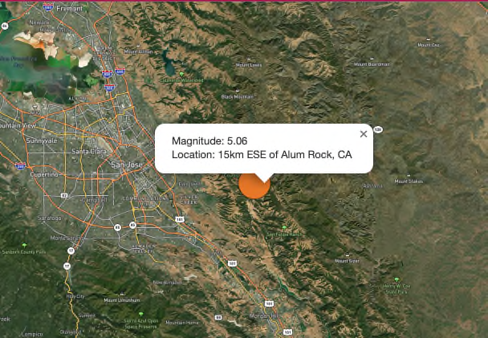

# Mapping Earthquakes

## Overview

This project visually presents the differences between the magnitudes of earthquakes all over the world for the last seven days.

Each earthquake will be represented as a circle on a map. The circles will be larger and darker in color as the magnitude of the earthquake it represents is greater.

## Usage

A few maps and overlays are available for the user to get different perspectives on the earthquakes that have occurred over the past 7 days. The following image shows the layer control available for selecting a map layer and 0 or more overlays:

### Maps

Currently 3 maps are available to the user. The map provides the background for the overlays. By default, the 'Streets' map will be selected with a map centered on North America.

The user can 'grab' the map with the cursor to move it around and view other continents all around the globe.

- #### Streets:

  This is a general-purpose map that emphasizes accurate, legible styling of road and transit networks. When an earthquake hits in or near a neighborhood, this map can be used to zoom in to see which streets were affected the most.

- #### Satellite:

  This is a full global base map that is works as a blank canvas that combines the Mapbox Satellite with vector data from Mapbox Streets.

- #### Outdoors:
  This is another general-purpose map with curated tilesets and specialized styling tailored to hiking, biking, and the most adventurous use cases. This map can be used to zoom in to see the elevation of the epicenter and surrounding areas.

### Overlays

Once the map is selected, the user can select any of the overlays to be placed on top the map by checking or unchecking the boxes next to each overlay. This section will show how selecting a map background with various layers can be used to visualize different aspects of the earthquake data.

The following overlays are available to choose from:

- #### Earthquakes

  This overlay will show all earthquakes. Refer to the legend to compare the magnitude of each earthquake based on color. The size of the circle marking the epicenter of an earthquake indicates the magnitude as well.

- #### Tectonic Plates

  Select this overlay to show the tectonic plate boundaries around the globe. The plates can be used along with the locations of each earthquake to witness the correlation between the number and intensity of earthquake activity compared to the distance from a plate boundary.

- #### Major Earthquakes

  This overlay will show only show earthquakes with a magnitude of 4+. This allows the user to reduce the number of markers on the map to easily focus on the larger ones of interest.

  Note that at the time of this writing there are no longer any earthquakes greater than magnitude 5. Since these screenshots have been taken, the code has been modified to only have 3 colors with a new one of deeper red for earthquakes with a magnitude above 6.

  The code was also modified to show magnitude 5 earthquakes in the same color whether the map is showing all earthquakes or only major ones. This reduces the confusion when the selection is changed from all earthquakes to major earthquakes.

- #### Orogens

  According to Wikipedia: "An orogenic belt, or orogen, is a zone of Earth's crust affected by orogeny. An orogenic belt develops when a continental plate crumples and is uplifted to form one or more mountain ranges; this involves a series of geological processes collectively called orogenesis."

  Clicking on Orogens will display the orogen layer.

### Legend

The legend increases the color intensity as the magnitude of an earthquake intensifies. Colors and magnitudes range from 0 to 5+. When Major Earthquakes is selected, if there are any earthquakes with a magnitude greater than 6, the marker will have an even deeper color red than shown in the legend.

Thankfully, these earthquakes are somewhat rare, however, there may not be any available to show up on the map in this color.

## Examples of Maps with Layers

### Streets Map with All Earthquakes

The following image shows all the earthquakes that occurred over the week of Oct. 25th to Nov. 1st 2022. Note how the red circles mark the earthquakes with a magnitude of 5+ and are the largest circles on the map. Earthquakes with lower magnitude are green/yellow and smaller circles.

### Streets Map with Tectonic Plates

De-selecting all layers except for the Tectonic Plates layer shows all the boundaries of the tectonic plates around the globe.

Notice how on the previous showing all the earthquakes and the tectonic plate boundaries that almost all major earthquakes are along the boundaries.

Most notably are earthquakes that show up where there are no boundaries such as in the interior of the continental US. Do these quakes have any correlation with fracking in these areas?

### Tectonic Plates Surrounding South America and Africa

As we zoom into South America and Africa, we see how the boundaries seem to perfectly fit together around these two continents.

### Streets Map with Orogens

Here we can see all the orogens around the globe.

### Outdoor Map without Zoom

This map uses an Outdoor map for the background. Note that it does not look much different than the streets layer.

Also, this map only shows major earthquakes. In particular, the earthquake that recently occurred outside of San Jose will be used as an example to focus on.

### Outdoor Map with San Jose Earthquake

As we zoom into the outdoor map with focus on the recent earthquake in San Jose we can start to see the terrain.

### Outdoor Map showing Elevation

Zooming in some more, we can see the elevation where the recent San Jose earthquake occurred.

### Earthquake Details

To get more detail on the recent earthquake near San Jose, we can click on the circle marker.

Note that the magnitude is 5.06, the location was 15 km ESE of Alum Rock, CA which is just outside of San Jose.

Also note that this quake occurred almost exactly 1 week before completing this readme. In the previous image, this quake is shown in an orange color as this color was used to represent earthquakes of magnitude between 5 and 6 on the major earthquake layer but on the all earthquakes layer, any quakes with a magnitude greater than 5 is shown at the top of the scale shown in the legend.

Changes to the code, added an additional color to distinguish earthquakes with a magnitude greater than 6. Fortunately there have not been anymore earthquakes greater than 6 since last Tuesday, however, we cannot show what they would look like in at the time of this writing.

### Satellite Map showing All Earthquakes

Using the Satellite map layer we can get a view of the terrain as it looks via satellite. This map shows all earthquakes.

### San Jose Earthquake on Satellite Map

Zooming into the satellite map with only major earthquakes, we can focus on the earthquake near San Jose and see the streets and other details of the terrain.

Note that this image was taken before the week passed. Since the popup was recently modified to include the date and the earthquake is no longer available, the popup only shows the Magnitude and Location.

## Summary

As we have seen, there are a multitude of ways the maps and layers can be used to zoom in and move around on the map to learn about various earthquakes throughout the world.

Hope you enjoyed this journey and find more ways to use these maps to investigate more earthquakes over time.
